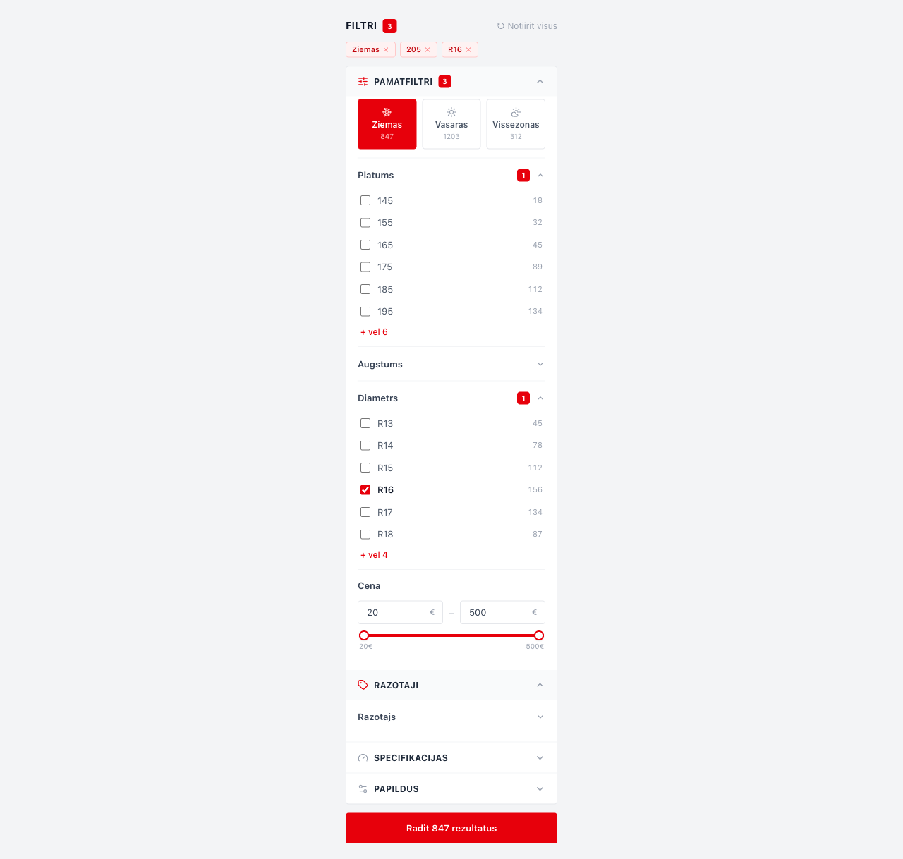

# Tireshop.lv FE Audits

**Sagatavoja:** Rendijs Berkis
**Datums:** 2026-02-27

---

## TOP 6 Uzlabojumi

### 1. Filtru strukturesana pa sekcijam un vizuala hierarhija
- **Problema:** Visi filtri ir viena gara saraksta bez vizualas grupesanas. Galvenie filtri (izmers, sezona, cena) nav nodaliti no sekundarajiem (decibeli, kravnesiba, atruma indekss).
- **Risinajums:** Sadalit filtrus sekcijas: "Pamatfiltri" (vienmer redzami), "Specifikacijas" (collapsible), "Papildus" (collapsible). Sticky pamatfiltri desktop, drawer ar accordion mobile.
- **Prioritate:** High — ~1 diena

### 2. Mobile filtru drawer nav implementets
- **Problema:** Mobile lieto to pasu sidebar ka desktop. Nav sticky bottom bar. Visi konkurenti izmanto full-screen filtru drawer.
- **Risinajums:** Sticky bottom bar: Filtri | Kartot. Full-screen drawer ar accordion sekcijam. "Radit X rezultatus" poga apaksa.
- **Prioritate:** High — ~1 diena

### 3. Footer un darba laiku attielosanas problemas
- **Problema:** Sakumlapa footer rada darba dienu nosaukumus (P.O.T.C.P., Sestdiena, Svetdiena) bet nerada darba laikus. Ieksejam lapam footer rada "loading..." visai kontaktinformacijai.
- **Risinajums:** Debug GraphQL/Apollo query. Pievienot fallback/cache strategiju. Parliecinaties ka darba laiki tiek atgriezti un attieloti pareizi.
- **Prioritate:** Quick win — ~2h

### 4. Produkta detalju lapa ir minimalistiska
- **Problema:** Viens attels, nav galerijas, nav atsauksmju, nav EU riepu etiketes. Apraksts biezvi ir "Produktam nav pieejams apraksts". Daudzi specifikaciju lauki ir "-".
- **Risinajums:** Attelu galerija ar zoom. EU etiketes badges. Atsauksmju sistema. Slepti tuksos laukus. Related products sekcija.
- **Prioritate:** Medium — ~2-3 dienas

### 5. Disku lapas kartisu layout nav optimizets
- **Problema:** Disku produktu saraksta videja kartite ir izteikti saurak neka parejie — nevienmerigas kolonnu platumi. Nepieciesams ari produktu kartisu dizaina uzlabojums.
- **Risinajums:** Vienads grid ar vienmerigi sadalitam kolonnam (CSS grid / equal-width columns). Konsistents kartisu izmers visam kolonnam. Kartisu layout optimizacija ar fiksetu augstumu.
- **Prioritate:** Medium — ~1-2 dienas

### 6. Produktu URL struktura nav SEO-friendly
- **Problema:** URL satur encoded atstarpes (%20), ieksejos ID numurus (435347), jauktu valodu (veikals/disks). Piem.: `/veikals/disks/435347/REPLICA%20WHEELS/F5832/6.5-16.0?lang=lv`
- **Risinajums:** Tiri slugi ar defisem: `/veikals/diski/replica-wheels/f5832-6-5-16`. Nonemt ieksejos ID no URL. Konsistenta valoda visam celam.
- **Prioritate:** Medium — ~1 diena

---

## Prioritasu kopsavilkums

- **Quick win:** #3 (~2h)
- **High:** #1, #2 (~1 diena katrs)
- **Medium:** #4, #5, #6 (~1-3 dienas katrs)

---

## Riepu Filtru Panelis

React + TypeScript + Tailwind CSS



Sekcijas:
- **Pamatfiltri** — Sezona, Platums, Augstums, Diametrs, Cena
- **Razotaji** — Visi razotaji ar meklesanu
- **Specifikacijas** — EU etikete (degviela, sakere, troksnis), atruma indekss, kravnesiba
- **Papildus** — Run-flat, Radzes, XL, DOT, OEM

```bash
cd src
npm install
npm run dev
```
